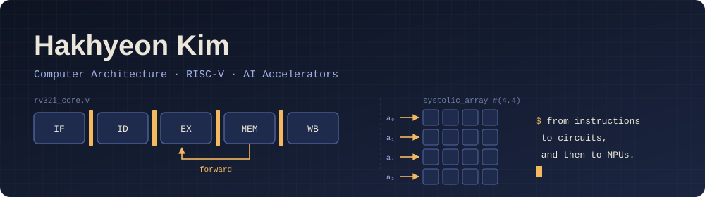

  

  <b>Undergraduate Researcher @ <a href="https://sites.google.com/site/embeddedsochallymuniv/home">A.I. Accelerator Computing Lab (AIAC)</a></b> 
  School of Software, Hallym University · Advisor: Prof. Jeonggun Lee  
  I want to understand, and then build, the hardware that software runs on.

---

### 🧭 What I'm into

- **Computer architecture**: datapaths, pipelining, hazards, memory hierarchy
- **RISC-V**: designing an RV32I processor from scratch in Verilog
- **AI accelerators / NPUs**: systolic arrays, dataflow, how compute meets memory bandwidth
- **Teaching tools**: making the link between assembly and real circuits *visible*

### 🔧 Now building

| Project | What it is | Status |
|---|---|---|
| **RV32I Core** | 32-bit RISC-V integer processor in Verilog HDL. Single-cycle first, then a 5-stage pipeline with forwarding & hazard detection | 🟡 In progress |
| [**Hallym Circuit Studio**](https://github.com/ars2323/hallym-circuit-studio) | Micro-architecture lab tool for Hallym University (Logisim 2.7.1 fork). Programs exported from Hallym MIPS run on a real CPU circuit | 🟢 Working |
| [**Hallym MIPS Simulator**](https://github.com/ars2323/hallym-mips-simulator) | MIPS32 simulator for Hallym University Computer Architecture courses | 🟢 Working |
| [**QtSpim-Edu**](https://github.com/ars2323/qtspim-edu) | Educational GUI extension of QtSpim 9.1.24, simulator core unmodified | 🟡 In progress |

**Roadmap:** `RV32I single-cycle` → `5-stage pipeline` → `FPGA` → `xv6-based mini OS` → `custom MAC instruction for NN acceleration`

### 🏆 Awards

| Year | Competition | Result | Awarded by |
|---|---|---|---|
| 2026 | SW Capstone Design Competition (Spring Semester) | 🥇 **Grand Prize** | President, Hallym University |
| 2026 | Gangwon AI·SW Festival Project Competition | **Special Award** | Joint Directors, Gangwon SW-Centered University Program |
| 2025 | Hana Social Venture University, Final Showcase | **Encouragement Award** | Chairman, Hana Financial Group |
| 2025 | Promising Student Startup Teams 300+ | **Selected** (Growth Track) | Minister of Education |
| 2025 | 12th National ICT Smart Device Contest | 🥇 **Grand Prize** | Minister of Science and ICT |
| 2025 | University Startup Idea Challenge (Youth Startup Blooming Day) | **Creativity Award** | Ministry of SMEs and Startups · KISED |
| 2025 | Dongbuk-gwon ICT Innovation Square Startup Idea Competition, SW Development Track | **Encouragement Award** | President, Gangwon Information & Culture Industry Promotion Agency |
| 2025 | Gangwon Startup Tantan-daero Idea Competition | **KNU Startup Innovation Institute Director's Award** | Director, KNU Startup Innovation Institute |

### 📚 Path so far

- **Undergraduate Researcher, AIAC Lab**: deep learning acceleration, GPU/parallel computing, FPGA

- **Digital Logic Design & Computer Architecture**: where it clicked that hardware is what runs software
- **CUDA & Parallel Programming** (summer session): got hooked on accelerating compute
- **IDEC Semiconductor Design Education Center**
  - *NPU Design Fundamentals* (Korea University)
  - *RISC-V Architecture & Linux Kernel Porting* (Chonnam National University)
- **Station C Flight Solve-A-Thon** (Jul 2025): completed, Hallym University Startup Support Center
- **Mentor / Lab TA** for Computer Architecture (SW Mentoring, Hallym Mentoring): MIPS assembly, QtSPIM labs

### 🛠 Tools & languages

**HDL / Hardware** 

**Software** 

**Environment** 

### 📈 Activity

  
  

---

  Interested in computer architecture & accelerator research. Always happy to talk hardware.

